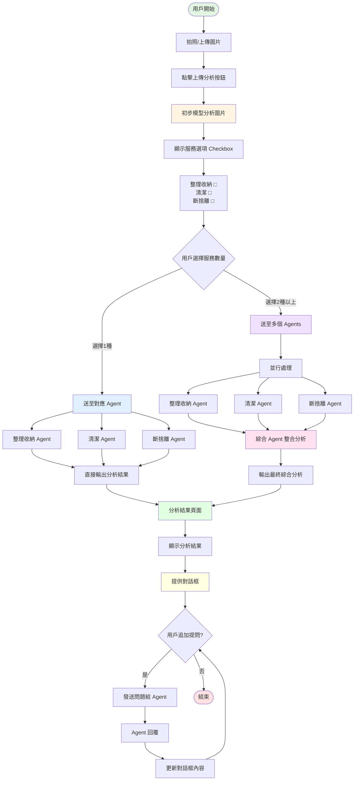

# GleamHome AI 服務流程圖

## 居家清潔應用程序工作流程

以下是用戶使用整理收納、清潔、斷捨離三種服務的完整流程：

## 流程說明

### 1. 圖片上傳階段
用戶可以透過拍照或上傳圖片的方式提供需要分析的環境照片。

### 2. 初步分析
系統使用 AI 模型對上傳的圖片進行初步分析，識別圖片中的物品、環境狀態等資訊。

### 3. 服務選擇
根據初步分析結果，系統顯示三個可複選的服務選項：
- **整理收納**：提供空間整理和物品收納建議
- **清潔**：提供清潔方案和清潔技巧
- **斷捨離**：提供物品取捨建議和極簡生活指導

### 4. AI Agent 處理
- **單一服務**：如果用戶只選擇一種服務，系統直接將資料送至對應的專門 Agent，快速輸出分析結果
- **多重服務**：如果用戶選擇兩種以上的服務，系統會：
  1. 將資料並行送至多個對應的 Agents 進行專業分析
  2. 將各個 Agent 的分析結果匯總到綜合 Agent
  3. 綜合 Agent 整合所有資訊，產生最終的全面分析報告

### 5. 結果展示與互動
- 在分析結果頁面顯示完整的分析內容
- 提供即時對話框功能，讓用戶可以：
  - 針對分析結果提出問題
  - 要求更詳細的說明
  - 請求額外的建議
  - 與 AI 進行持續對話

### 6. 持續優化
用戶的提問和對話內容可以幫助系統更好地理解用戶需求，提供更精準的服務。
